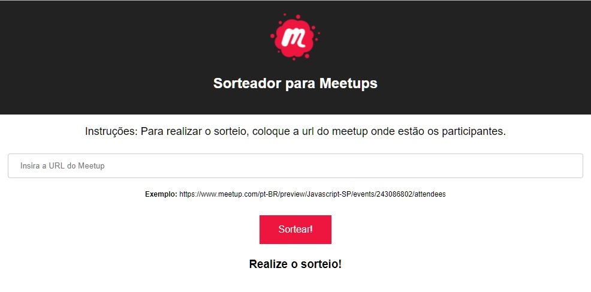

# Sorteador para Meetups

Quantas vezes você já foi a um Meetup (ou promoveu um) e não havia maneira prática de fazer um sorteio para os participantes? Pois bem, este problema agora está no passado, porque agora existe o Sorteador para Meetups! Ele funciona a base da técnica de _web scraping_, ou seja, da extração de informações de páginas da internet.

Como a API do Meetup nos impede de buscar informações sobre os participantes de um Meetup (_ateendes_) - a não ser que você seja um dos organizadores - desenvolvemos esta ferramenta para que qualquer um possa utilizá-la facilmente.

## Funcionamento

No campo disponível, basta colocar a lista de participantes de um dado Meetup. Como por exemplo:
- https://www.meetup.com/pt-BR/preview/Javascript-SP/events/243086802/attendees

Toda vez que o botão sortear for acionado, um dos participantes que estão na primeira lista será sorteado.

## Desenvolvimento

Este projeto foi arquitetado para subir facilmente o backend e o frontend em uma tacada só. 

Para subir em modo de desenvolvimento:
`npm run start-dev`

Para subir em produção:
1. Execute o `npm run build` para gerar os arquivos do front. Eles serão construídos em `client\build`.
2. Executar o `npm start`